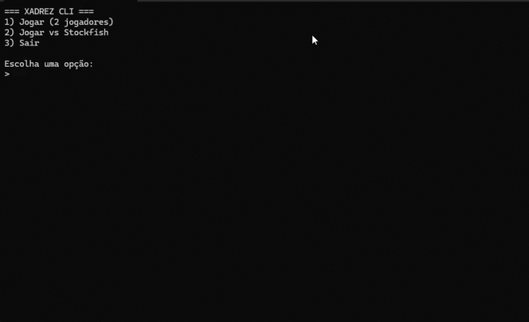

# xadrez

CLI de xadrez para terminal, com suporte a:

- Partida local (2 jogadores)
- Partida contra Stockfish
- Modo normal e modo as cegas
- Menu interativo e tratamento de erros
- Persistencia de partidas em SQLite
- Estatisticas de vitorias/empates/desistencias
- Historico paginado e replay de partidas

## Requisitos

- Node.js 18+

## Instalacao

### Usando npm localmente

```bash
npm install
npm start
```

### Usando como CLI global

```bash
npm install -g xadrez-cli
xadrez
```

## Como jogar

Ao iniciar, o menu principal oferece:

1. Jogar (2 jogadores)
2. Jogar vs Stockfish
3. Estatisticas
4. Historico de partidas
5. Sair

Depois de escolher o tipo de partida, voce escolhe:

1. Normal
2. As cegas
3. Voltar

Se escolher Stockfish, ha um menu de dificuldade:

1. Facil (depth 4)
2. Medio (depth 8)
3. Dificil (depth 16)
4. Voltar

## Entradas de jogada

Digite jogadas no formato esperado pelo `chess.js`, por exemplo:

- `b1c3`

o sistema aceita entrada tipo `e2e4`, é o mais confiavel.

## Comandos durante a partida

- `menu`: volta ao menu principal
- `novo`: reinicia a partida atual
- `sair`: encerra o programa
- `tabuleiro`: mostra o tabuleiro (util quando estiver no modo as cegas)

Se o jogador usar `sair` no meio da partida, o resultado e salvo como desistência.

## Banco de dados (SQLite)

As partidas e jogadas sao salvas automaticamente em um banco SQLite local.

- arquivo: `data/chess.db`
- tabela `games`: metadados da partida (modo, depth, resultado, total de jogadas)
- tabela `game_moves`: historico de jogadas com SAN e FEN

## Estatisticas

A tela de estatisticas mostra:

- total de partidas finalizadas
- vitorias das brancas
- vitorias das pretas
- empates
- desistencias das brancas
- desistencias das pretas
- media de jogadas

Tambem exibe as ultimas partidas registradas.

## Historico paginado

O historico e exibido em paginas de 10 partidas por vez.

Comandos disponiveis:

- `n`, `>`, `->`: proxima pagina
- `p`, `<`, `<-`: pagina anterior
- `1` a `10`: abrir partida da linha escolhida
- `limpar`: apagar todo o historico (com confirmacao)
- `Esc` ou `voltar`: voltar ao menu principal

Nota: no terminal, as setas direita/esquerda tambem funcionam para navegar paginas.

## Replay de partida

Ao abrir uma partida do historico, voce pode navegar lance a lance:

- `->` (seta direita) ou `>`: proximo lance
- `<-` (seta esquerda) ou `<`: lance anterior
- `fen`: mostra a FEN da posicao atual
- `Esc` ou `voltar`: retorna ao historico

## Modo as cegas

No modo as cegas, o console e limpo a cada lance e apenas o ultimo movimento e exibido, por exemplo:

`Pretas — Nf6 (g8 → f6)`

## Scripts

- `npm start`: executa a aplicacao
- `npm run check`: valida sintaxe de todos os arquivos principais
- `npm test`: alias para `npm run check`
- `npm run seed`: gera partidas automaticas Stockfish vs Stockfish no banco

### Seed de partidas

Voce tambem pode gerar partidas em lote:

```bash
node scripts/seed-games.js [quantidade] [depth]
```

Exemplo:

```bash
node scripts/seed-games.js 50 16
```

Isso ajuda a popular o historico para testes de paginacao e replay.

## Estrutura do projeto

```text
.
├── index.js
├── package.json
└── src
    ├── controller
    │   └── GameController.js
    ├── engine
    │   └── ChessEngine.js
    ├── player
    │   └── StockfishPlayer.js
    ├── renderer
    │   ├── ChessJsBoardRenderer.js
    │   └── UnicodeBoardRenderer.js
    └── ui
        └── ConsoleUI.js
```

[](./video/xadrez.gif)

## Licenca

ISC
